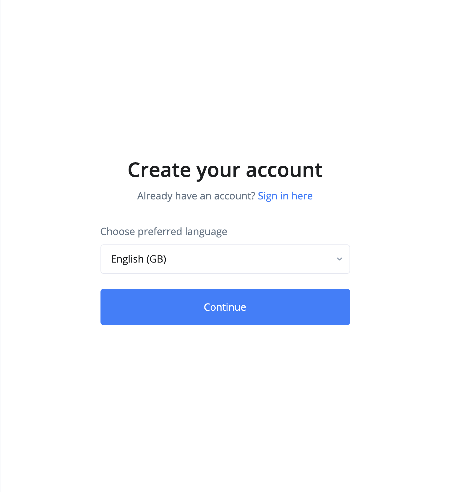
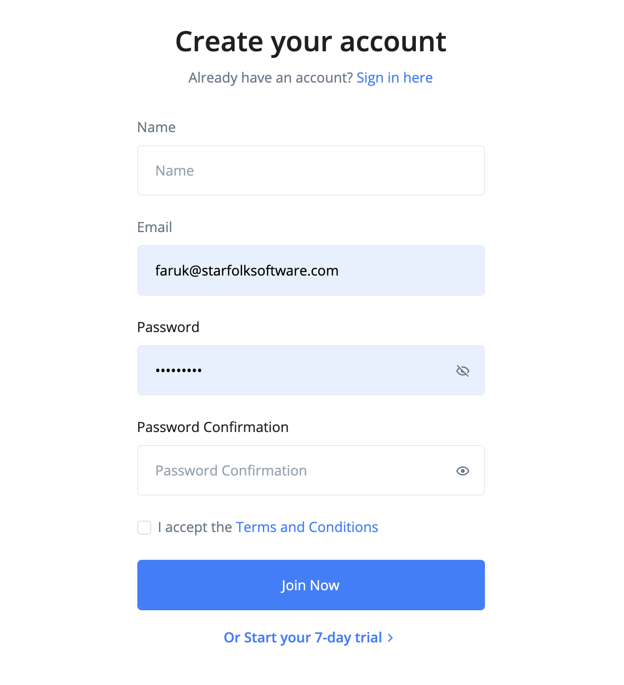
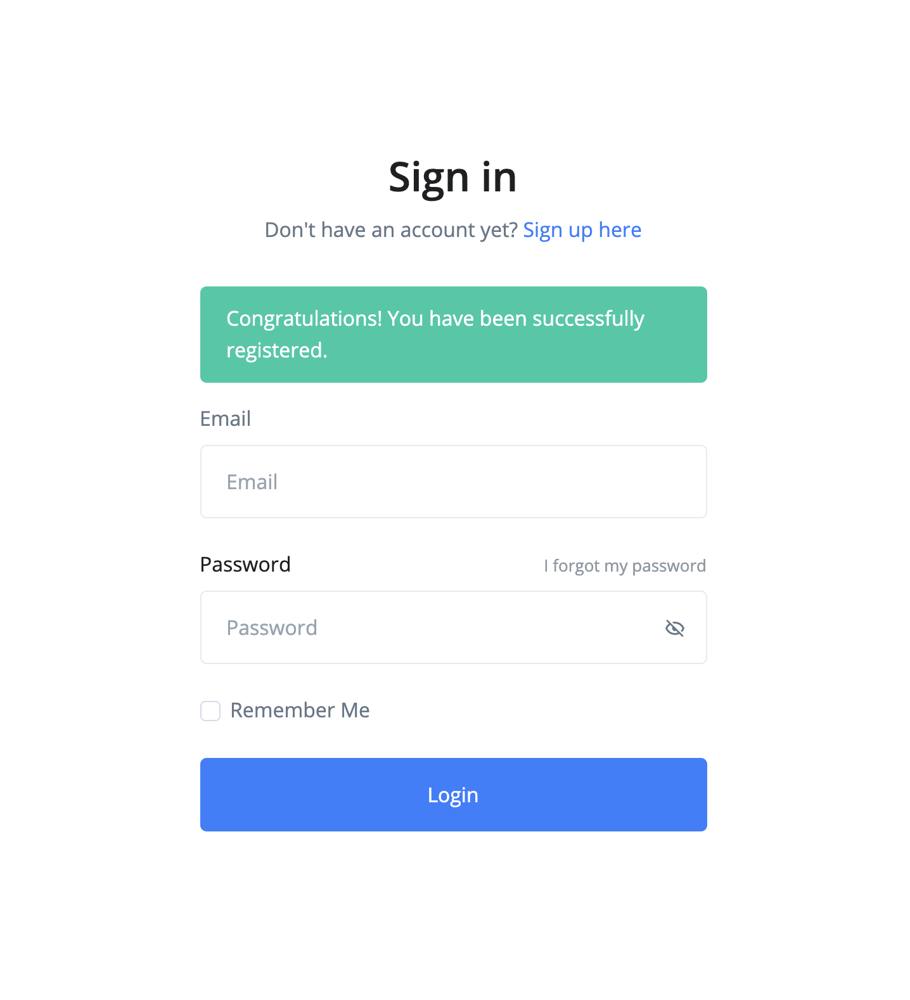
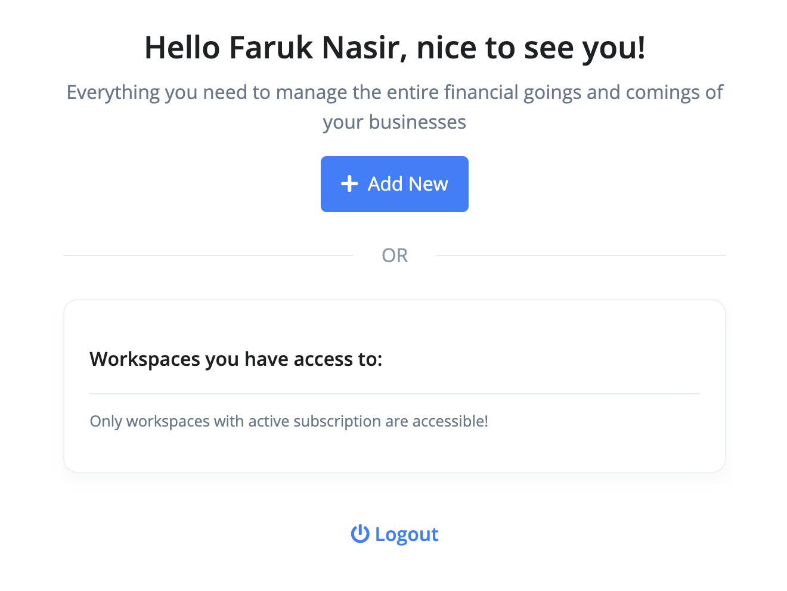
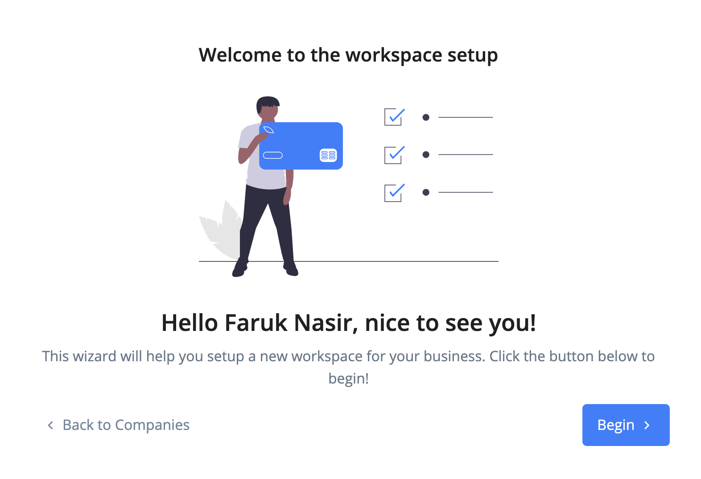
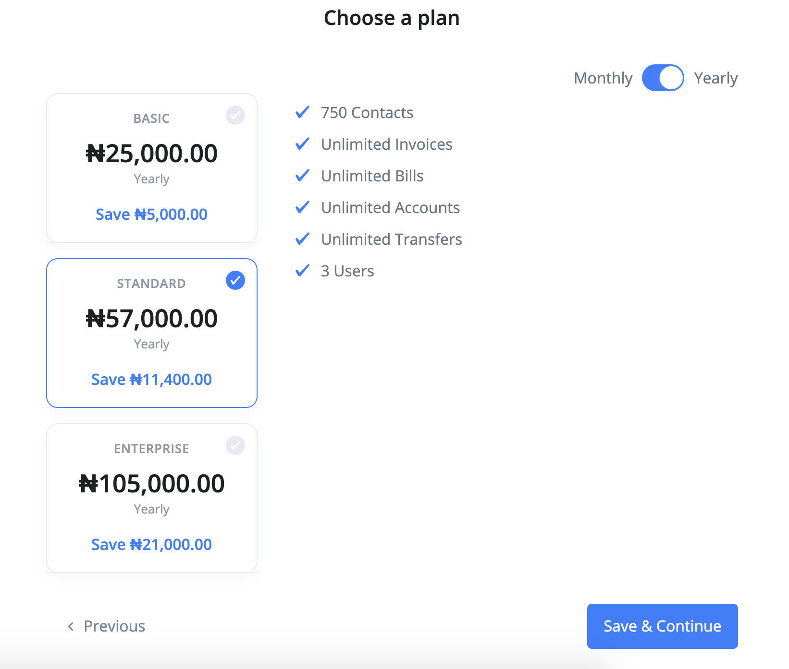
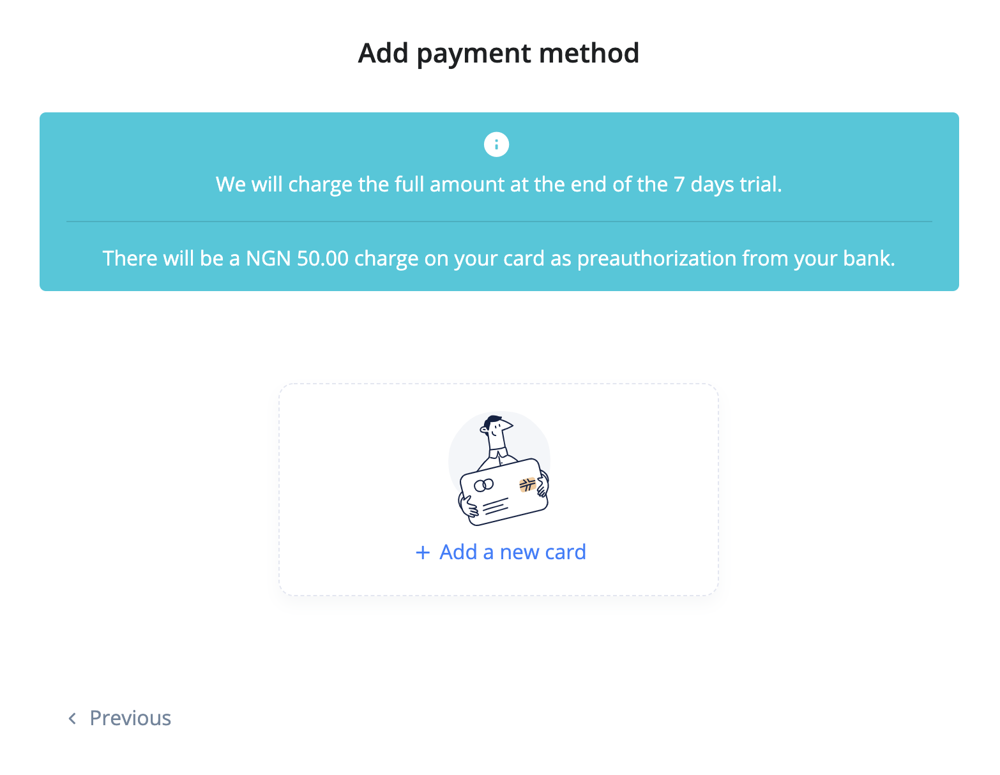
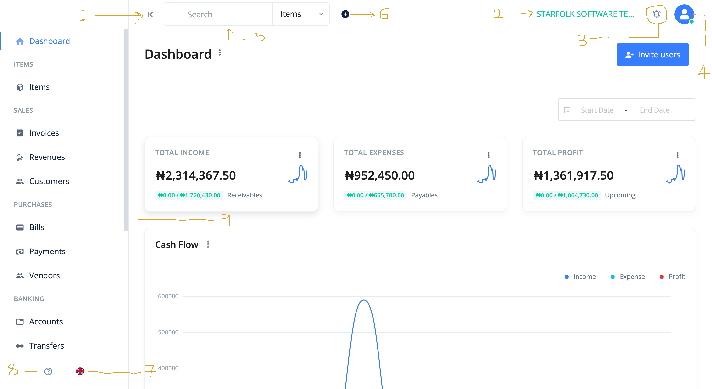

# What is Ciniki Accounting?

Ciniki is a full-featured accounting software for small businesses that allows you to easily track and manage your finances in one place. Ciniki helps you get your work done more efficiently. With Ciniki, you can manage all your businesses in one place, detect and eliminate bank transaction errors, find and review invoices in seconds and do book-keeping in your language with regional currency support. When you need an online accounting software that can handle recurring payments, bills and invoices, with Ciniki, you don't have to look any further!

Let's get started!

## Usage Requirements

- Any device capable of running a modern browser (Desktop Computer, Laptop, Tablet or Mobile Phone)
- An Internet Connection
- A browser

## Browser Support

We strongly suggest that you use the latest version of the following brower(s):

- Chrome

Other browser(s) we support:

- Firefox
- Safari
- Edge

## Getting Started

Ready to give your business the accounting spin it needs to get to the next level? Make sure you have all that it's needed listed above and visit [the sign up page](https://workspace.cinikiapp.com/auth/register/language).

To signup, use the following steps:

1. Select a preferred language and click the `continue` button.

2. Enter `name`, `email` and `password` and `password confirmation`.

3. Accept the `terms and conditions` and click the `submit` button.

4. You will be redirected to the login page with a message that your registration has been successful.

## Workspace Setup

You have successfully registered. Now you want to setup your workspace. These are the steps:

1. Go to the [the sign in page](https://workspace.cinikiapp.com/auth/login) and login.
2. You will then be directed to the workspace launch page. From here, you can either launch from the list of workspaces or create a new one.

3. To initiate a new workspace setup, click on the `Add New` button. This will take you the setup welcome page. Click on the `Begin` button to start.

4. Enter the `name`, `email` and other details of the company. Click `Save & Continue` button. This will take you to the plan selection page.

5. Select the plan that best suits your business, choose the payment cycle (monthly or yearly) and click `Save & Continue` button. This will take you to the payment method addition page.

6. Click on the `Add Payment Method` card button. A popup should now be on the screen asking you for your card details. We don't save any of your card information. We use [Paystack](https://paystack.co) as the payment provider.

7. Congratulations! You have successfully setup your workspace. You should be directed to the dashboard now.

## Ciniki User Interface

The dashboard was designed with the user in mind. It is simple, intuitive and extremely easy to use. This is so you don't spend hours reading the documentation and, instead, utilize your intuition for guidance.

1. **Side Minimize Button** - With this button you can minimize the side bar. This is useful when you need more space to work with on the right.

2. **Workspace Name** - This is the name of the active workspace.

3. **Notifications** - All your notifications in one place.

4. **Account Dropdown** - Access account related links such as profile, user management, workspace quick launch etc from this dropdown.

5. **Global Search** - Search your items, invoices, contacts and bills from here.

6. **Quick Actions** - From here, you can quickly create items, invoices, bills etc. without having to consult the sidebar navigation.

7. **Language Switch** - Quickly switch the language of the workspace for a particular session.

8. **Quick Links** - Quick access to important links.

9. **Sidebar** - Sidebar navigation housing the links to important sections of the software.
