# Dashboard

When you launch a workspace, the dashboard is the first page that you see. It houses a number of [widgets](03-manage-widgets.md) that give you a general view of your business at any given time. All incomes and expenses related widgets show accrued amounts with the exception of `Cash Flow` widget. You can learn more on accrual account [here](https://www.investopedia.com/terms/a/accrualaccounting.asp#:~:text=Accrual%20accounting%20is%20an%20accounting,recognized%20in%20the%20same%20period.).

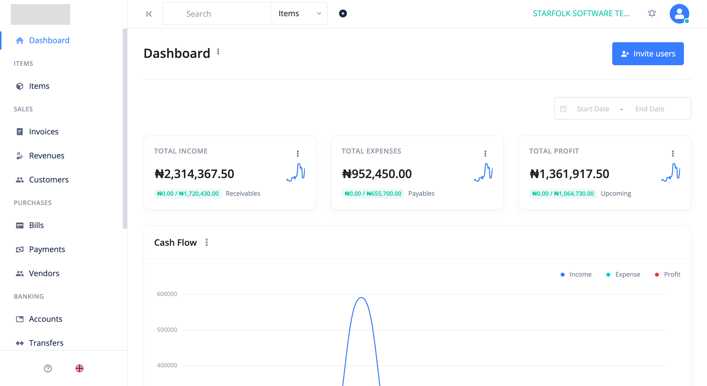

BizBooq supports multiple dashboards. This means you can create more than one dashboard for a workspace and attach them to users. This way your workspace users can conveniently be concerned with only the widgets that are relevant to them according to their roles.

## Date Range

You can use the date range to instruct your widgets to show you results between two set dates.

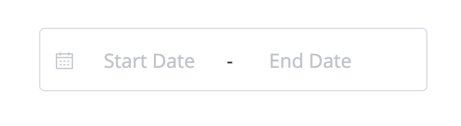

## Total Income

The **Total Income** widget shows the total amount generated from your business' sale of goods or services. It displays your company's total earnings or income within the current date range of the dashboard.

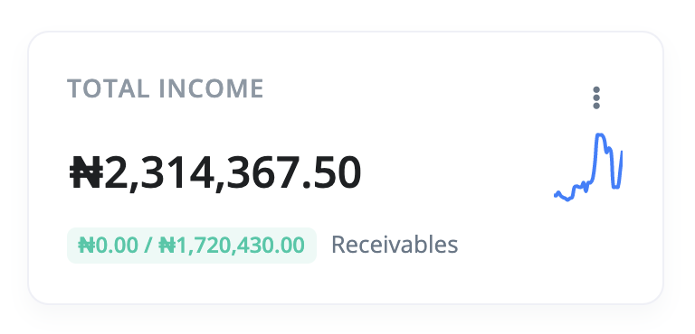

## Total Expenses

The **Total Expenses** widget shows the total spending of your business before the net income within the current date range of the dashboard.

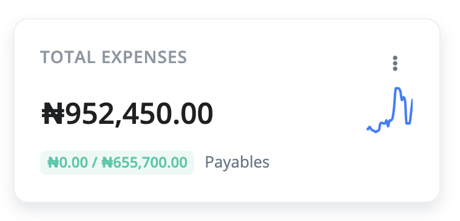

## Total Profit

The **Total Profit** widget shows you how much money your business has left over after all the expenses within the current date range of the dashboard.

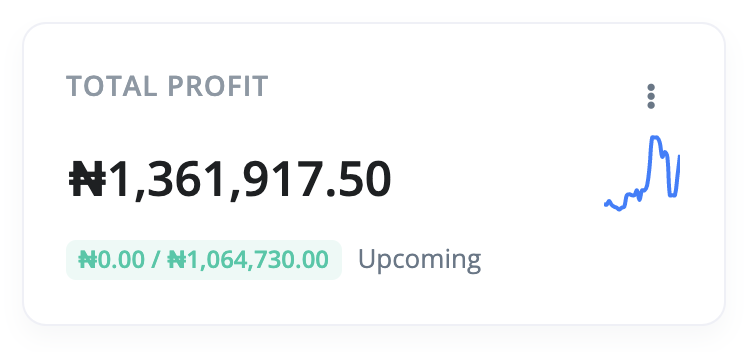

## Cash Flow

The **Cash Flow** widget displays the **income**, **expense**, and **profit** of your business in a beautiful line chart.

- **Income** - This line represents the money received on a monthly basis for items or services sold within the selected date range of the dashboard.

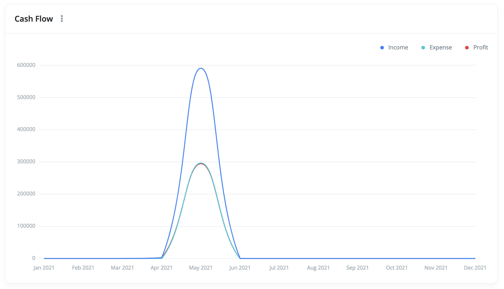

- **Expense** - This line represents the cost of operations that your business incurs to generate revenue within the selected date range of the dashboard.

- **Profit** - The profit line represents the money left after all expenses are settled.

## Income (By Category)

The **Income By Category** widget displays the income of each category within the selected date range of the dashboard.

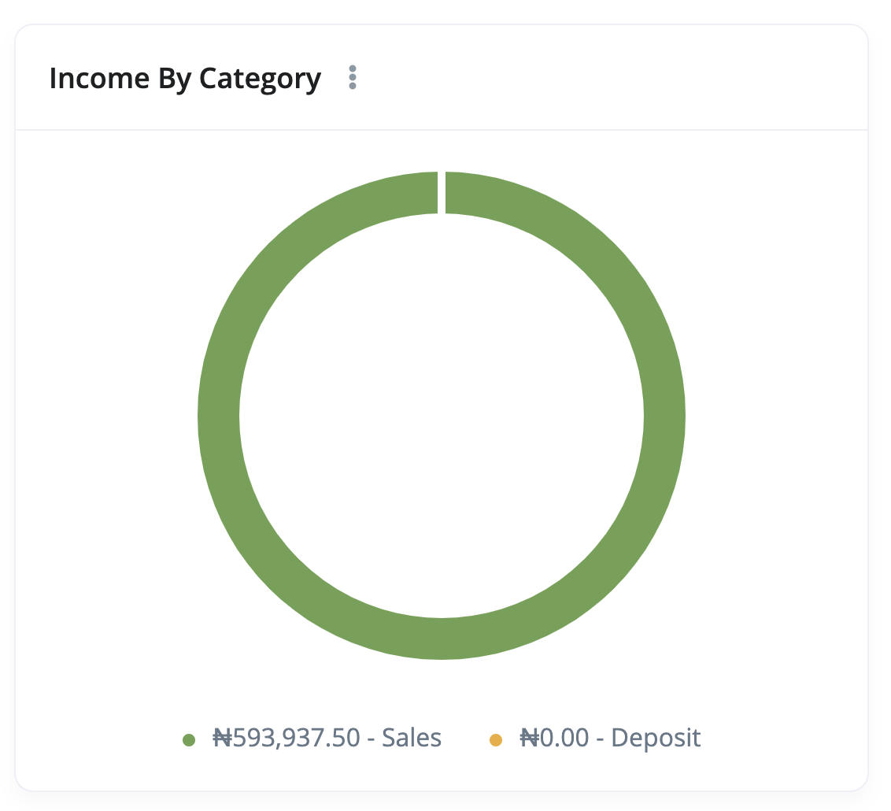

It shows:

- A donut chart
- A list of categories at the bottom with their corresponding income.

## Expenses (By Category)

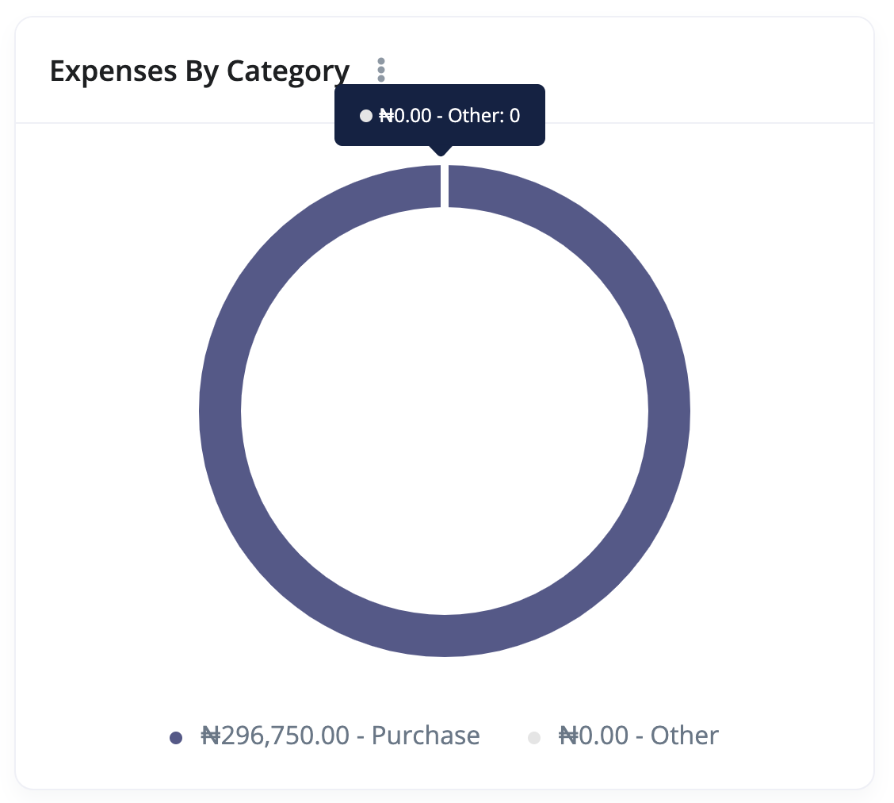

Just like the **Income By Category**, The **Expense By Category** widget displays the expense of each category within the selected date range of the dashboard.

It shows:

- A donut chart
- A list of categories at the bottom with their corresponding expense.

## Account Balance

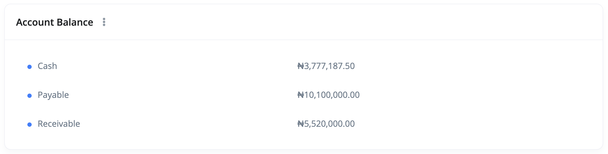

The **Account Balance** widget lists all the bank accounts with their corresponding balance. This widget is immune to the date range selector.

## Latest Income

The **Latest Income** widget shows the latest income recorded within the selected date range of the dashboard.

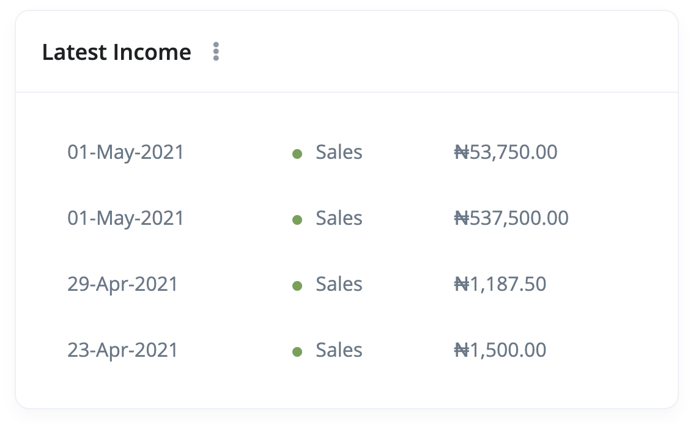

## Latest Expense

The **Latest Expense** widget shows the latest expense recorded within the selected date range of the dashboard.

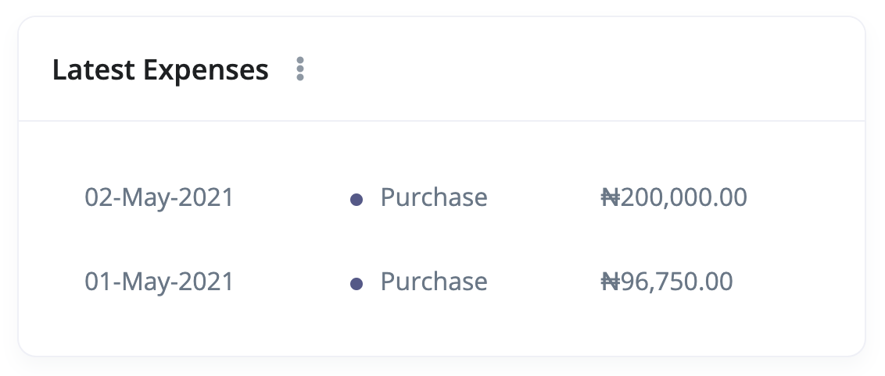

