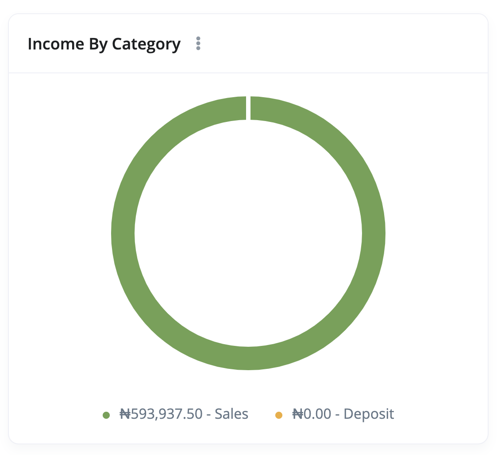
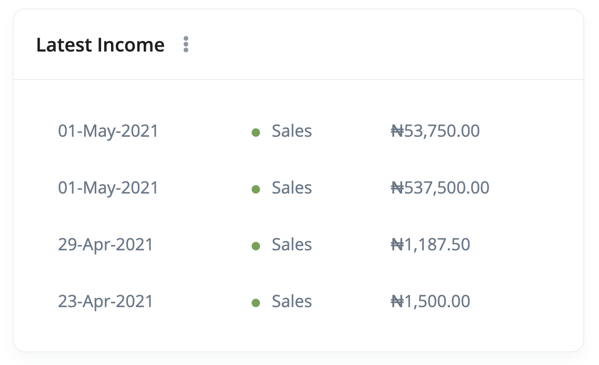

# How do I create a dashboard?

Dashboards give you a quick overview of your business at any given time. 

- [Create a dashboard](#create-dashboard)
  - [Dashboard details](#dashboard-details)
  - [Assign/Unassign dashboard to users](#assign-unassign)
- [Widgets](#widgets)
  - [Create a widget](#create-widget)
  - [Widget details](#widget-details)
  - [Saving a widget](#save-widget)
- [FAQs](#faqs)

## Create Dashboard 

The following are the steps for creating a dashboard:

1. On the dashboard, Click the ellipsis close to the title. This will open a dropdown with `Add Widget`, `Create Dashboard` and `Manage Dashboards` links.

There are two ways to create the dashboard: 

2. Click on the `Create Dashboard`. This will take you directly to the dashboard creation form page.

3. Click on the `Manage Dashboard`. This will take you to the dashboard listing page. From that page click the `Add New` from the top right corner of the page.

### Dashboard Details 

4. On the dashboard form enter the following details:

  - **Name**: `required` This is the name of the dashboard. 
  - **Users**: `optional` The users the dashboard will be assigned to.
  - **Enabled**: `required` This is a switch button determining whether the dashboard is enabled/disabled.

5. Once you're done, click the `save` button at the bottom of the page. 

## Widgets 

Ciniki has a number of widgets that you can add to a dashboard. They are:

- **Total Income** - The **Total Income** widget shows the total amount generated from your business' sale of goods or services. It displays your company's total earnings or income within the current date range of the dashboard.

- **Total Expense** - The **Total Expenses** widget shows the total spending of your business before the net income within the current date range of the dashboard.

- **Total Profit** - The **Total Profit** widget shows you how much money your business has left over after all the expenses within the current date range of the dashboard.

- **Cash Flow** - The **Cash Flow** widget displays the **income**, **expense**, and **profit** of your business in a beautiful line chart.

- **Incomes By Category** - The **Income By Category** widget displays the income of each category within the selected date range of the dashboard.

- **Expenses By Category** - Just like the **Income By Category**, The **Expense By Category** widget displays the expense of each category within the selected date range of the dashboard.

- **Account Balance** - The **Account Balance** widget lists all the bank accounts with their corresponding balance. This widget is immune to the date range selector.

- **Latest Income** - The **Latest Income** widget shows the latest income recorded within the selected date range of the dashboard.

- **Latest Expense** - The **Latest Expense** widget shows the latest expense recorded within the selected date range of the dashboard.

### Create Widget 

The following are the steps for creating a widget:

1. On the dashboard, Click the ellipsis close to the title. This will open a dropdown with `Add Widget`, `Create Dashboard` and `Manage Dashboards` links.

2. Click on the `Add Widget` link. A widget creation modal will appear on your screen.

### Widget Details 

3. Fill the `name`, `width`, `type` and `sort` fields of the form.

- **Name** - This is the name that will appear at the top of the widget card regardless of the type.
- **Width** - This determines how a widget appears. A **25%** width for a widget means that widget takes up one-quarter of the screen horizontally.
- **Type** - Select the type of the widget. Available optionas are `Total Income`, `Total Expense`, `Total Profit`, `Cash Flow`, `Income By Category`, `Expense By Category`, `Account Balance`, `Latest Income` and `Latest Expenses`.
- **Sort** - This is the order in which the widget will appear on the dashbaord

### Save widget 

5. Once you're done, click on the save button at the bottom of the screen. This will save the new widget and refresh the dashboard.

## FAQs 