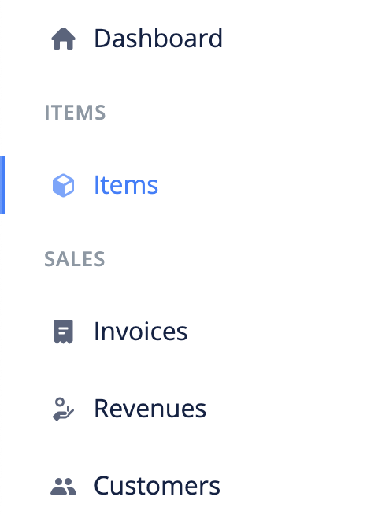

# What are items?

Items are the goods(tangible) and services(intangible) that you sell. When creating an item, you can add tax to it so that they're automatically included whenever the item is added to a bill or an invoice. Adding all your items before-hand allows you to quickly add them to invoices and bills.

- [Create Item](#create-item)
- [Edit item](#edit-item)
- [Import Items](#import-items)
- [Export Items](#export-items)
- [FAQs](#faqs)

## Create Item 

The following are the steps for creating an item:

1. Click the `Items` link from the sidebar navigation.

2. Click the `Add New` at the top right corner of the page.

3. Fill in the item's information and `save`.

## Edit Item 

To make changes to an item, use these steps:

1. Click the `Items` link from the sidebar navigation.
2. Click edit from the dropdown actions of the Item you want to edit.
3. Make your changes and `save`.

## Import Items 

A very important feature of BizBooq is the ability to transfer data from other accounting softwares.

Use the following steps to import Items into BizBooq:

1. Click the `Items` link from the sidebar navigation.
2. Click the `Import` button at the top left corner of the page. This brings up an import modal.

3. Download the sample file and adjust your file to its format.

4. Import your file.

## Export Items 

To export items:

1. Click the `Items` link from the sidebar navigation.
2. Click the `Export` button at the top left corner of the page. This brings up an export modal.

3. Adjust the export configurations and click the `Export` button.

## FAQs 
