# How do I create an Invoice?

Invoices are commercial documents that serve as records of transactions between a buyer and a seller. In BizBooq, it helps track your income. You can also specify an invoice as recurring. This way it will be automatically generated for you according to your settings.

An invoice:

- serves as a payment request to a customer for goods delivered or services rendered.
- provides your business with a sales records.
- is issued before payment is received.

To learn more:

- [Create Invoice](#create-invoice)
  - [Company, Customer and Invoice Details](#invoice-details)
  - [Items, Discounts and Taxes](#items)
  - [Total Area](#total-section)
  - [Notes, Terms and Invoice Attachments](#notes-terms-attachments)
  - [Currency, Category and Recurring](#curr-cat-recur)
  - [Save Invoice](#save)
- [Import Invoice](#import-invoice)
- [Export Invoice](#export-invoice)
- [FAQs](#faqs)

## Create Invoice 

To create an invoice:

1. Click the `Invoices` link from the sidebar navigation.

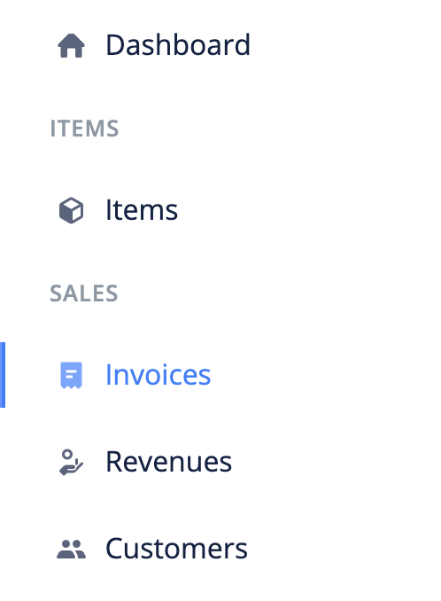

2. Click the `Add New` at the top right corner of the page.

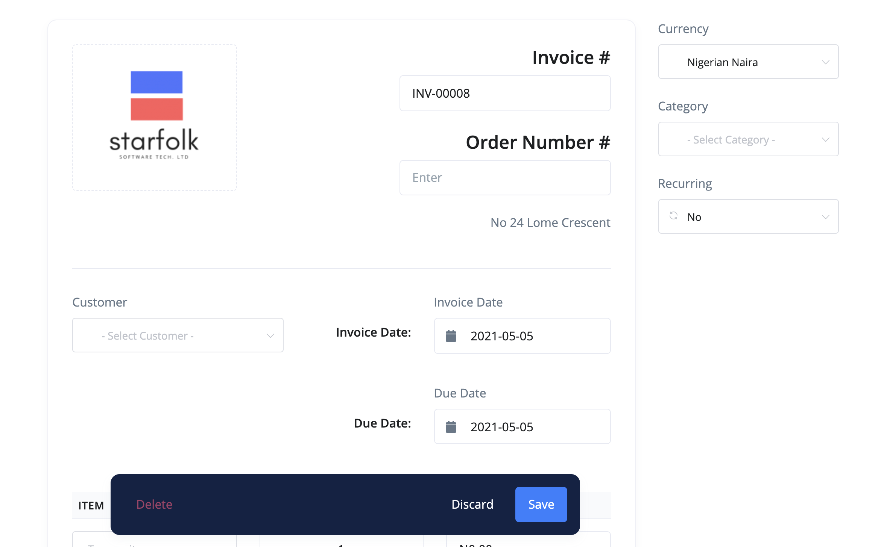

### Customer and Invoice Details 

3. Choose a customer for whom the invoice is intended for and fill in the relevant dates:

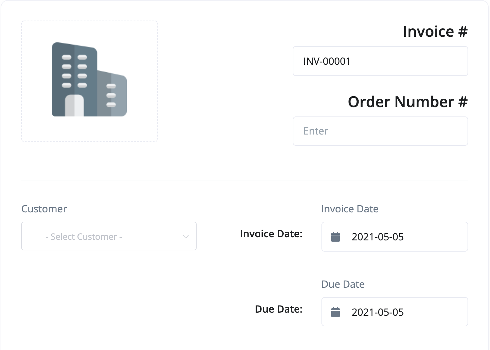

- **Invoice Number** - This is a unique, often times, sequencial number that is assigned to the invoice.

- **Customer** - The client the invoice is created for.

- **Invoice Date** - This is the date of the invoice. It defaults to today's date but, you can change it to whichever date you wish.

- **Due Date** - This is the date when the invoice is expected to be paid.

- **Order Number** - The order number is optional. It is an additional information that can serve as reference to the invoice.

### Items, Discounts and Taxes 

4. To add an item to the invoice, Click on the `Add Item` link under the items' section. Fill out the blank fields for the item. The item field is an *autocomplete* input field that will suggest items to you as you start to type.

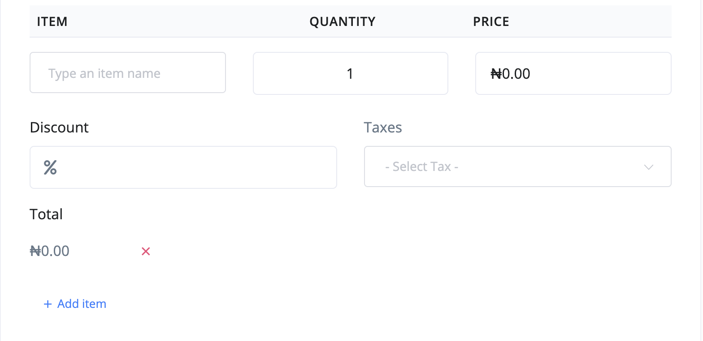

> You can use the red cancel icon next to the total input field to remove an item from the list.

> If you do not want the discount field to appear on a line item, you can change the setting from `settings > localisation`

### Total Section 

In the total section, you will see the `Subtotal`, `Line Discount`(if enabled), `Add Discount`(if enabled), `Tax` and `Total`.

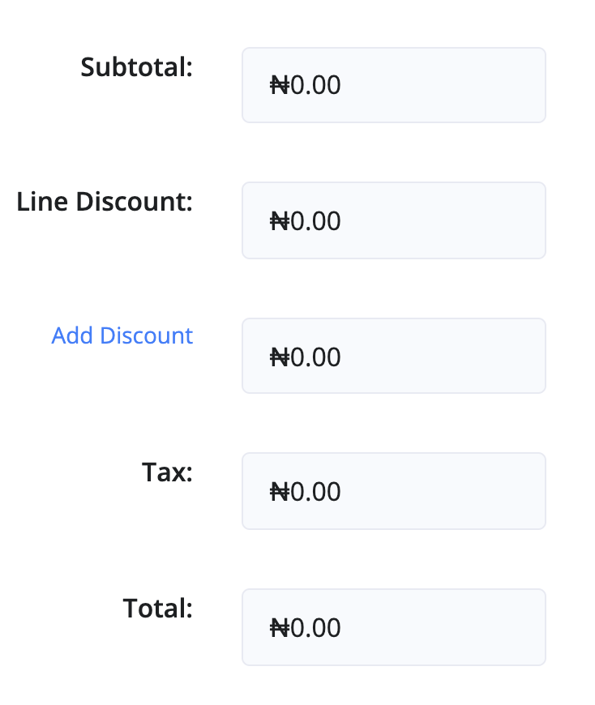

If enabled, you can add an overall discount to the invoice by clicking the `Add Discount` button. This will open a tooltip, enter a percentage and save.

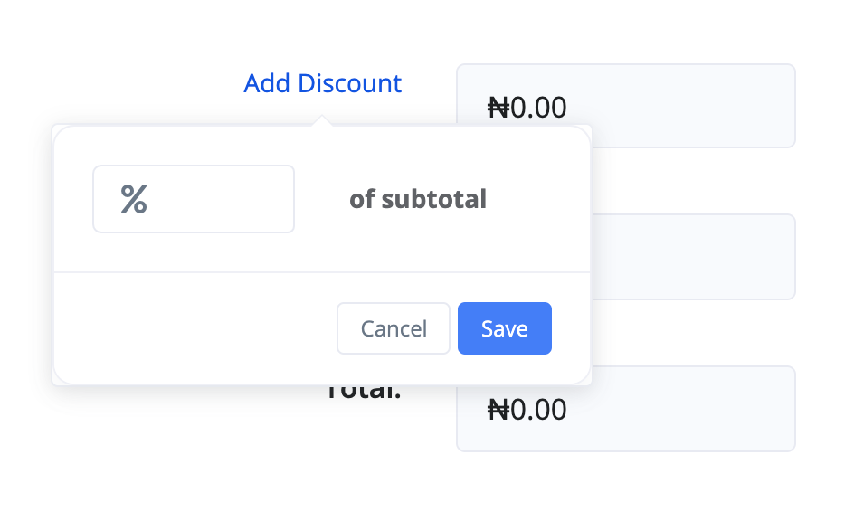

### Notes, Terms and Attachments 

Notes are useful for information that are specific to the attached customer.

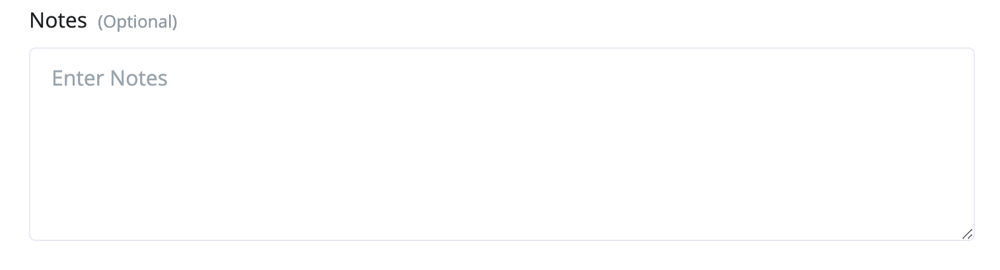

Footer is where the terms can be displayed. A default footer text can be set from `settings > invoice`.

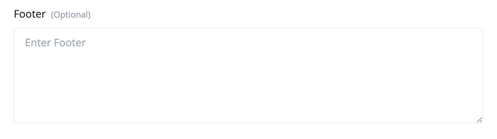

Attachment is where you share files and documents with your customer relevant to this particular invoice.

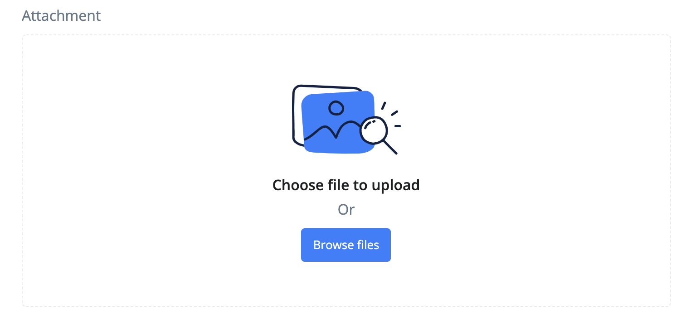

### Currency, Category and Recurring 

- **Currency** - You can set the currency for a particular invoice.

- **Category** - This is where you set the income category the invoice belongs to.

- **Recurring** - Set a recurring attribute to the invoice. It can be daily, weekly, monthly or yearly. You can even set a custom cycle.

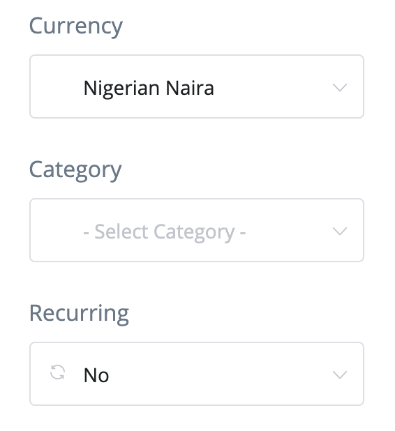

### Save Invoice 

5. Once you have entered all the information of the invoice, save it. You will be redirected to the invoice view page.

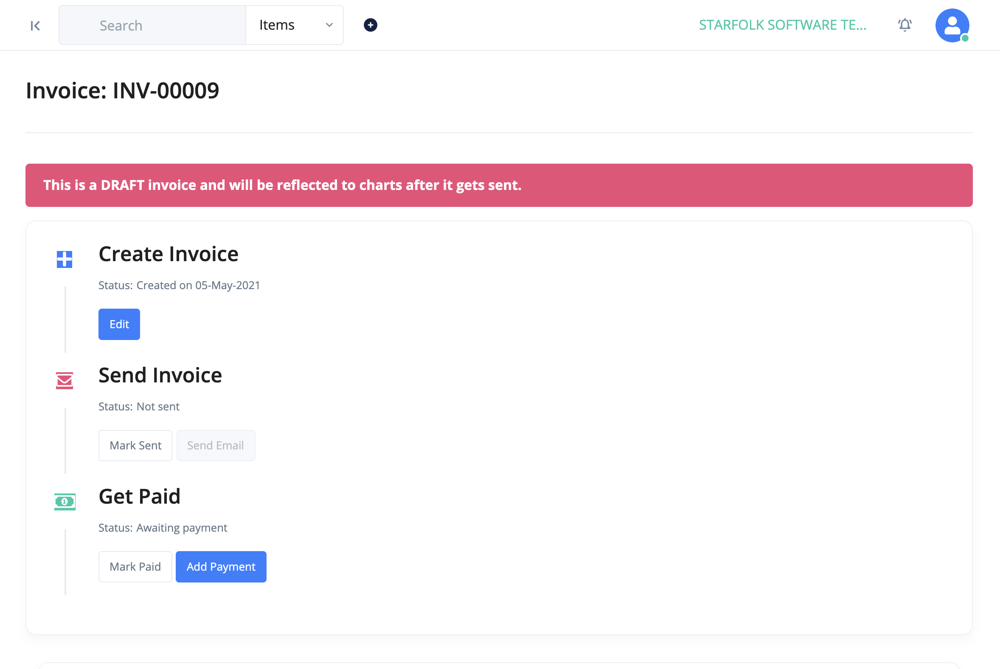

> The invoice will remain as draft and won't reflect in major calculations until it gets *sent* or is *marked as sent*. The buttons for sending and marking as sent can be found at the top of the page.

## Import Invoices 

A very important feature of BizBooq is the ability to transfer data from other accounting softwares.

Use the following steps to import Invoices into BizBooq:

1. Click the `Invoices` link from the sidebar navigation.
2. Click the `Import` button at the top left corner of the page. This brings up an import modal.

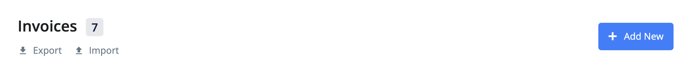

3. Download the sample file and adjust your file to its format.

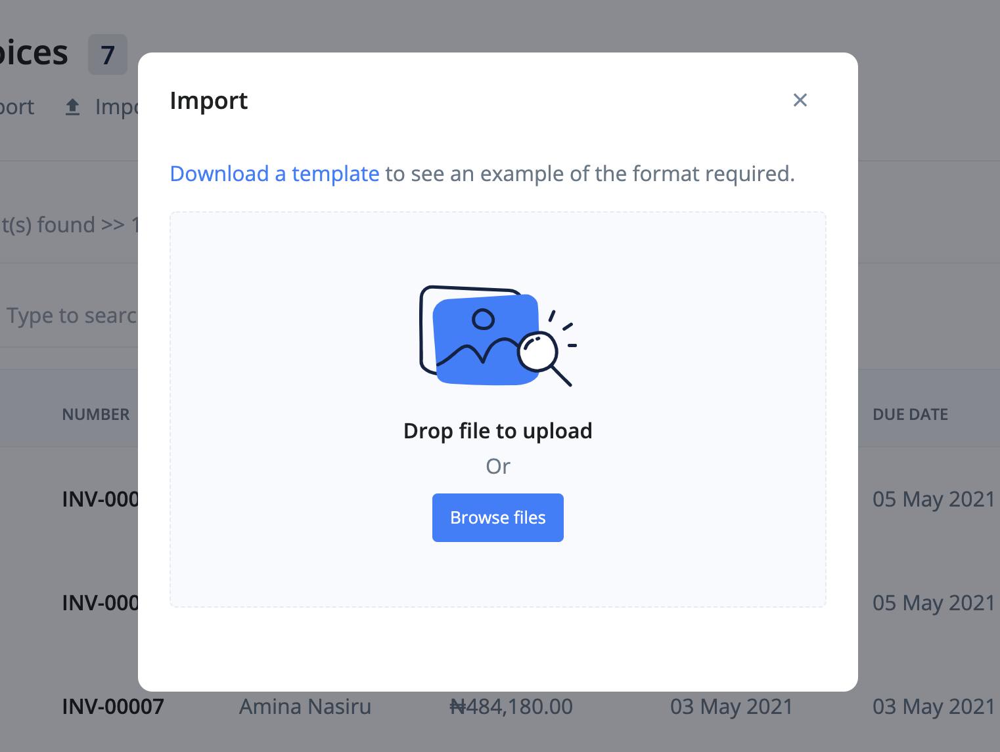

4. Import your file.

## Export Invoices 

To export invoices:

1. Click the `Invoices` link from the sidebar navigation.
2. Click the `Export` button at the top left corner of the page. This brings up an export modal.

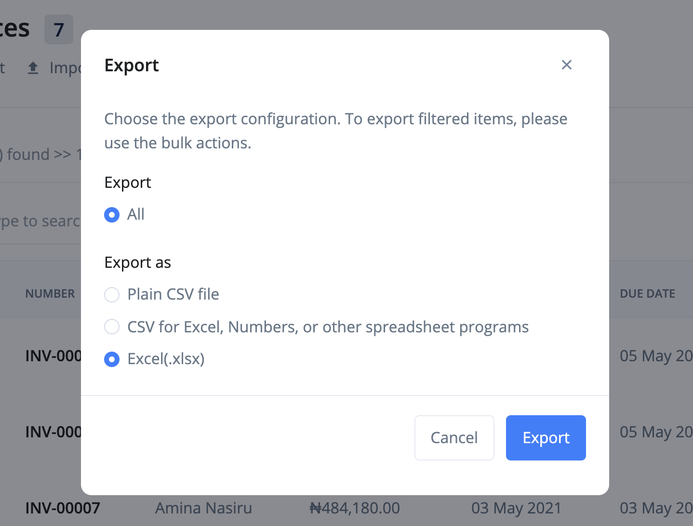

3. Adjust the export configurations and click the `Export` button.

## FAQs 

