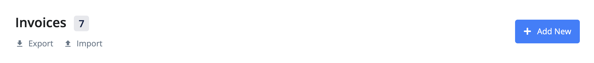

# How do I add, update or delete a Payment?

You have created and sent an invoice to your customer. The next logical step is getting paid. Currently, Ciniki only supports `offline payments`. Support for online payments is coming soon.

Find out how to add, update or delete a payment:

- [All Payments](#all-payments)
- [Adding payment to an invoice](#add-payments)
- [Updating a Payment](#update-payments)
- [Deleting a Payment](#delete-payment)
- [FAQs](#faqs)

## All Payments 

To see all recorded offline payments:

1. Click the `Revenues` link from the sidebar navigation. This should take you to the revenues listing page.

## Adding payment to an invoice 

You can add a payment in one of the following 3 ways:

- Revenue creation page.
- Imports.
- Directly recording payment on an invoice.

### Adding payments using the revenue creation page

1. Click the `Invoices` link from the sidebar navigation.
2. Click the `Add New` at the top right corner of the page.

3. Fill in the item's information and `save`.

### Adding payments using import

These are the steps:

1. Click the `Invoices` link from the sidebar navigation.
2. Click the `Import` button at the top left corner of the page. This brings up an import modal.

3. Download the sample file and adjust your file to its format.

4. Import your file.

### Adding payments on an invoice directly

To add a payment:

1. Click the `Invoices` link from the sidebar navigation.
2. Click view from the dropdown actions of the Invoice you want to add payment to.

3. Click on `Add Payment` button at the top of the page. This should bring up a payment addition modal. The amount will be populated with the full outstanding total. You can overwrite this with a different amount if needed. Ciniki supports partial payment addition.

4. Save the payment. If the payment amount is not the full outstanding total, the invoice status will change to `partial`.

## Updating a payment 

To make changes to a payment:

1. Click the `Revenues` link from the sidebar navigation.
2. Click edit from the dropdown actions of the Revenue you want to edit.
3. Make your changes and `save`.

## Deleting a payment 

To delete a payment:

1. Click the `Revenues` link from the sidebar navigation.
2. Click delete from the dropdown actions of the Revenue you want to delete. A confirmation modal will show on the screen.

3. Click delete.
