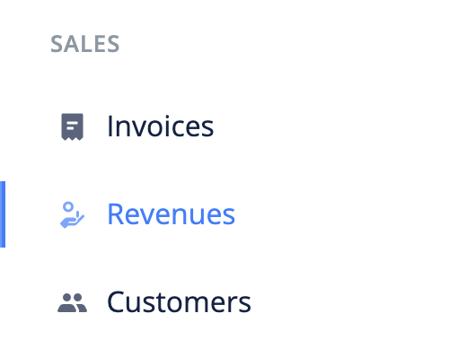

# What are revenues?

Revenues are income payments. It can be an independent record (i.e. deposit) or attached to an invoice.

- [Create Revenue](#create-revenue)
- [Edit Revenue](#edit-revenue)
- [Import Revenues](#import-revenues)
- [Export Revenues](#export-revenues)
- [FAQs](#faqs)

## Create Revenue 

The following are the steps for creating a revenue:

1. Click the `revenues` link from the sidebar navigation.

2. Click the `Add New` at the top right corner of the page.

3. Fill in the revenue's information and `save`.

## Edit Revenue 

To make changes to a revenue, use these steps:

1. Click the `revenues` link from the sidebar navigation.
2. Click edit from the dropdown actions of the revenue you want to edit.
3. Make your changes and `save`.

## Import revenues 

A very important feature of Ciniki is the ability to transfer data from other accounting softwares.

Use the following steps to import revenues into Ciniki:

1. Click the `revenues` link from the sidebar navigation.
2. Click the `Import` button at the top left corner of the page. This brings up an import modal.

3. Download the sample file and adjust your file to its format.

4. Import your file.

## Export revenues 

To export revenues:

1. Click the `revenues` link from the sidebar navigation.
2. Click the `Export` button at the top left corner of the page. This brings up an export modal.

3. Adjust the export configurations and click the `Export` button.

## FAQs 
