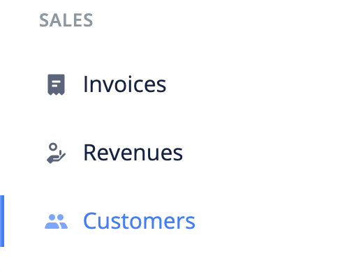
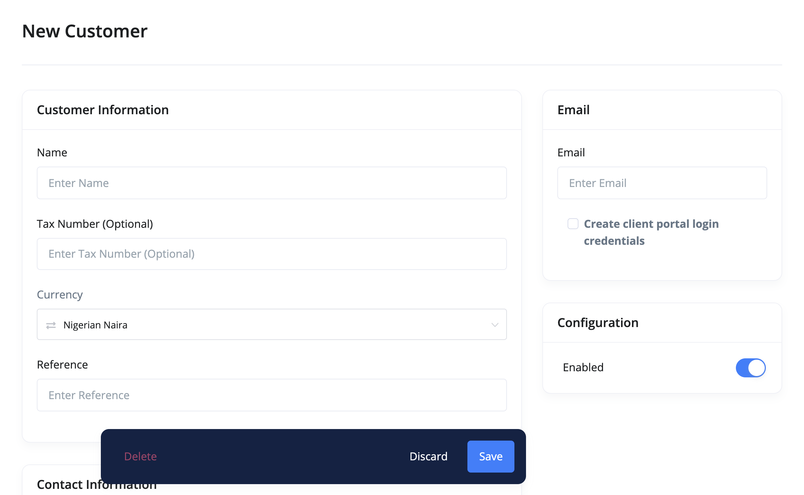

# Who is a customer?

A customer is a very important element of your business. This is because they are the buyers of your goods and services. It is very important that you save their contact details so that you can serve them better.

- [Create Customer](#create-customer)
- [Edit Customer](#edit-customer)
- [Giving a Customer Access To The Client Portal](#client-portal)
- [Import Customers](#import-customers)
- [Export Customers](#export-customers)
- [FAQs](#faqs)

## Create Customer 

The following are the steps for creating a customer:

1. Click the `customers` link from the sidebar navigation.

2. Click the `Add New` at the top right corner of the page.

3. Fill in the customer's information and `save`.

## Edit Customer 

To make changes to a customer, use these steps:

1. Click the `customers` link from the sidebar navigation.
2. Click edit from the dropdown actions of the customer you want to edit.
3. Make your changes and `save`.

### Giving a Customer Access To The Client Portal 

To give a customer access to the client portal, you check the client portal access checkbox while creating or updating the customer.

If the customer is already a Ciniki registered user, an email will be sent to them that they have been give access to the client portal of your workspace. Otherwise, an invitation link will be sent to their email. They will be automatically given access to your workspace's client portal after a successful registration using the link.

## Import customers 

A very important feature of Ciniki is the ability to transfer data from other accounting softwares.

Use the following steps to import customers into Ciniki:

1. Click the `customers` link from the sidebar navigation.
2. Click the `Import` button at the top left corner of the page. This brings up an import modal.

3. Download the sample file and adjust your file to its format.

4. Import your file.

## Export customers 

To export customers:

1. Click the `customers` link from the sidebar navigation.
2. Click the `Export` button at the top left corner of the page. This brings up an export modal.

3. Adjust the export configurations and click the `Export` button.

## FAQs 
