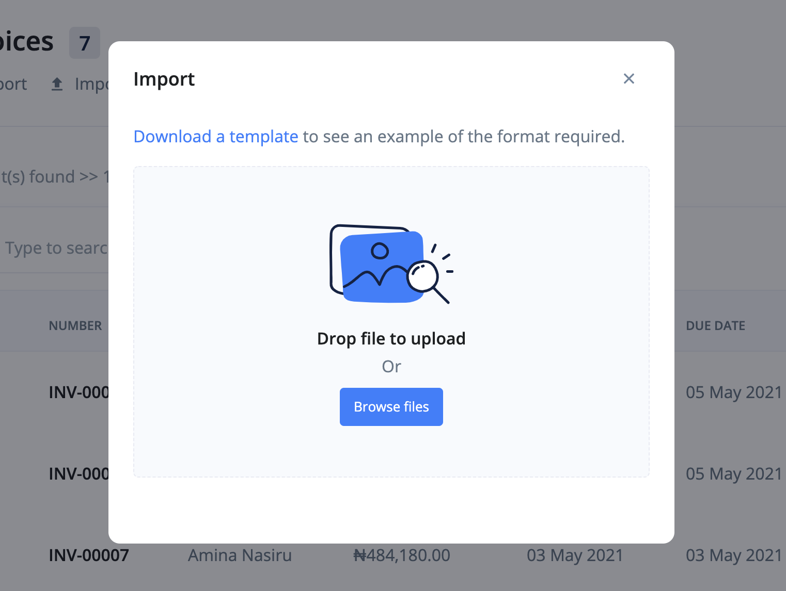

# How do I create a Bill?

Bills are commercial documents that shows the amount you owe your suppliers/vendors for goods received or services rendered. Just like a bill, You can also specify a bill as recurring. This way it will be automatically generated for you according to your settings.

A bill:

- serves as an expense record that must be paid.
- provides your business with a purchase records.
- is issued before payment is sent.

To learn more:

- [Create Bill](#create-bill)
  - [Company, Customer and Bill Details](#bill-details)
  - [Items, Discounts and Taxes](#items)
  - [Total Area](#total-section)
  - [Notes, Terms and Bill Attachments](#notes-terms-attachments)
  - [Currency, Category and Recurring](#curr-cat-recur)
  - [Save Bill](#save)
- [Import Bill](#import-bill)
- [Export Bill](#export-bill)
- [FAQs](#faqs)

## Create Bill 

To create a bill:

1. Click the `Bills` link from the sidebar navigation.

2. Click the `Add New` at the top right corner of the page.

### Customer and Bill Details 

3. Choose a customer for whom the bill is intended for and fill in the relevant dates:

- **Bill Number** - This is a unique, often times, sequencial number that is assigned to the bill.

- **Customer** - The client the bill is created for.

- **Bill Date** - This is the date of the bill. It defaults to today's date but, you can change it to whichever date you wish.

- **Due Date** - This is the date when the bill is expected to be paid.

- **Order Number** - The order number is optional. It is an additional information that can serve as reference to the bill.

### Items, Discounts and Taxes 

4. To add an item to the bill, Click on the `Add Item` link under the items' section. Fill out the blank fields for the item. The item field is an *autocomplete* input field that will suggest items to you as you start to type.

> You can use the red cancel icon next to the total input field to remove an item from the list.

> If you do not want the discount field to appear on a line item, you can change the setting from `settings > localisation`

### Total Section 

In the total section, you will see the `Subtotal`, `Line Discount`(if enabled), `Add Discount`(if enabled), `Tax` and `Total`.

If enabled, you can add an overall discount to the bill by clicking the `Add Discount` button. This will open a tooltip, enter a percentage and save.

### Notes and Attachments 

Notes are useful for information that are specific to the attached customer.

Attachment is where you share files and documents with your customer relevant to this particular bill.

### Currency, Category and Recurring 

- **Currency** - You can set the currency for a particular bill.

- **Category** - This is where you set the income category the bill belongs to.

- **Recurring** - Set a recurring attribute to the bill. It can be daily, weekly, monthly or yearly. You can even set a custom cycle.

### Save Bill 

5. Once you have entered all the information of the bill, save it. You will be redirected to the bill view page.

> The bill will remain as draft and won't reflect in major calculations until it gets *sent* or is *marked as sent*. The buttons for sending and marking as sent can be found at the top of the page.

## Import Bills 

A very important feature of Ciniki is the ability to transfer data from other accounting softwares.

Use the following steps to import Bills into Ciniki:

1. Click the `Bills` link from the sidebar navigation.
2. Click the `Import` button at the top left corner of the page. This brings up an import modal.

3. Download the sample file and adjust your file to its format.

4. Import your file.

## Export Bills 

To export invoices:

1. Click the `Bills` link from the sidebar navigation.
2. Click the `Export` button at the top left corner of the page. This brings up an export modal.

3. Adjust the export configurations and click the `Export` button.

## FAQs 

