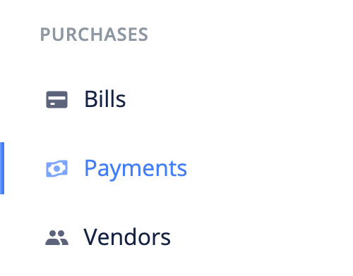
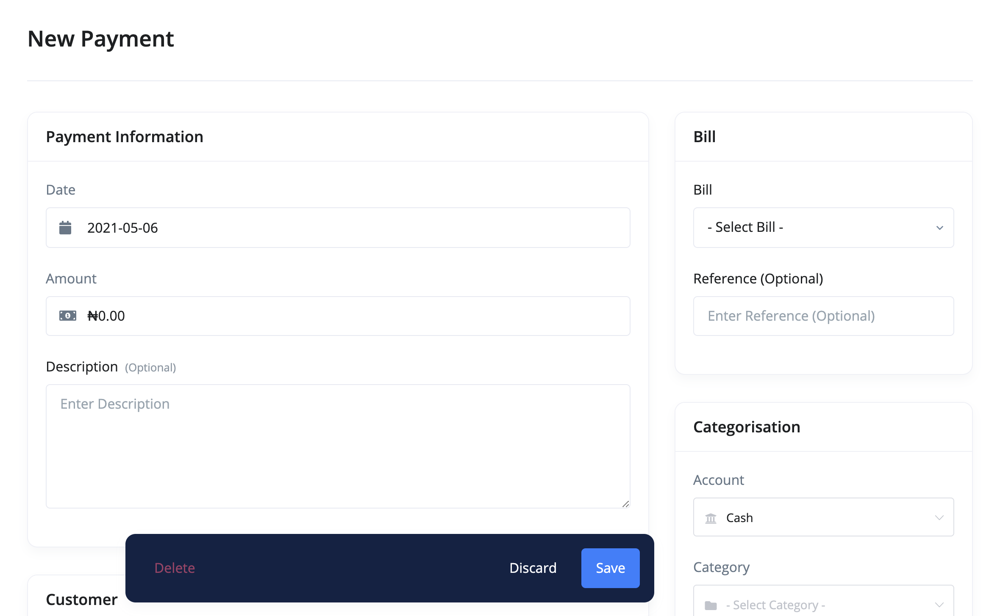
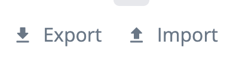
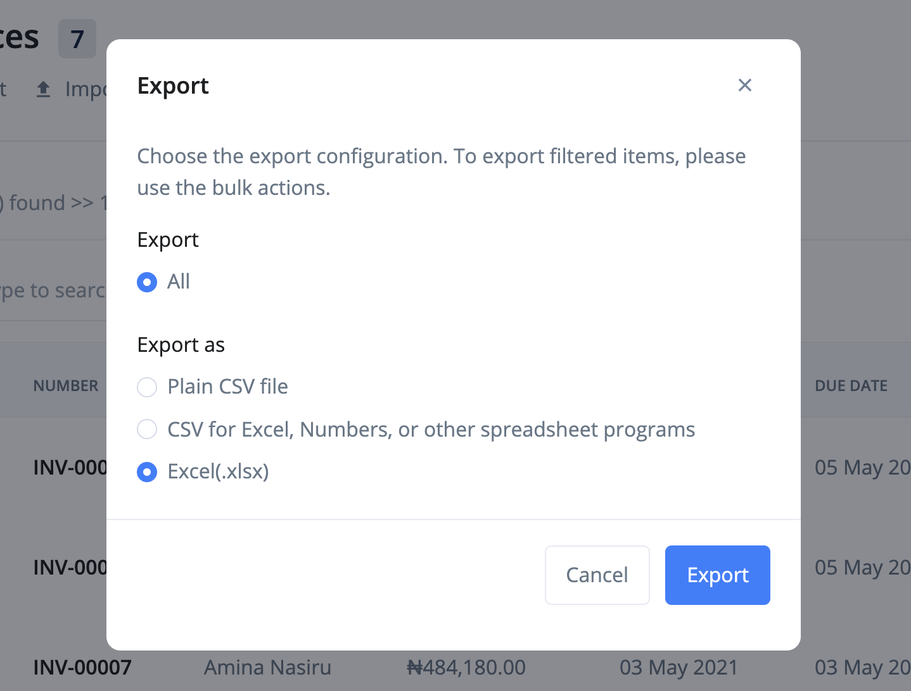

# What are payments?

Payments are revenues payments. It can be an independent record (i.e. purchase receipt) or attached to a bill.

- [Create Payment](#create-payment)
- [Edit Payment](#edit-payment)
- [Import Payments](#import-payments)
- [Export Payments](#export-payments)
- [FAQs](#faqs)

## Create Payment 

The following are the steps for creating a payment:

1. Click the `payments` link from the sidebar navigation.

2. Click the `Add New` at the top right corner of the page.

3. Fill in the payment's information and `save`.

## Edit Payment 

To make changes to a payment, use these steps:

1. Click the `payments` link from the sidebar navigation.
2. Click edit from the dropdown actions of the payment you want to edit.
3. Make your changes and `save`.

## Import payments 

A very important feature of BizBooq is the ability to transfer data from other accounting softwares.

Use the following steps to import payments into BizBooq:

1. Click the `payments` link from the sidebar navigation.
2. Click the `Import` button at the top left corner of the page. This brings up an import modal.

3. Download the sample file and adjust your file to its format.

4. Import your file.

## Export payments 

To export payments:

1. Click the `payments` link from the sidebar navigation.
2. Click the `Export` button at the top left corner of the page. This brings up an export modal.

3. Adjust the export configurations and click the `Export` button.

## FAQs 
