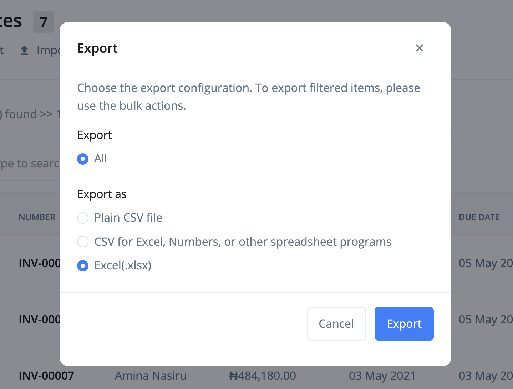

# Who is a vendor?

It costs to run a business. A vendor is a person or a business that you purchase products from. It is very important that you save their contact details for improved communication.

- [Create Vendor](#create-vendor)
- [Edit Vendor](#edit-vendor)
- [Import Vendor](#import-vendor)
- [Export Vendor](#export-vendor)
- [FAQs](#faqs)

## Create Vendor 

The following are the steps for creating a vendor:

1. Click the `vendor` link from the sidebar navigation.

2. Click the `Add New` at the top right corner of the page.

3. Fill in the vendor's information and `save`.

## Edit Vendor 

To make changes to a vendor, use these steps:

1. Click the `vendor` link from the sidebar navigation.
2. Click edit from the dropdown actions of the vendor you want to edit.
3. Make your changes and `save`.

## Import vendor 

A very important feature of Ciniki is the ability to transfer data from other accounting softwares.

Use the following steps to import vendor into Ciniki:

1. Click the `vendor` link from the sidebar navigation.
2. Click the `Import` button at the top left corner of the page. This brings up an import modal.

3. Download the sample file and adjust your file to its format.

4. Import your file.

## Export vendor 

To export vendor:

1. Click the `vendor` link from the sidebar navigation.
2. Click the `Export` button at the top left corner of the page. This brings up an export modal.

3. Adjust the export configurations and click the `Export` button.

## FAQs 
