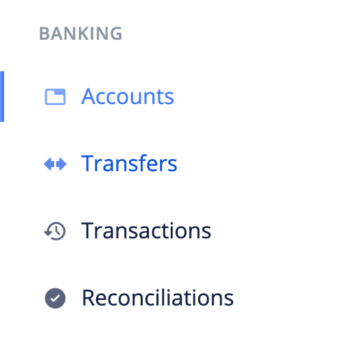
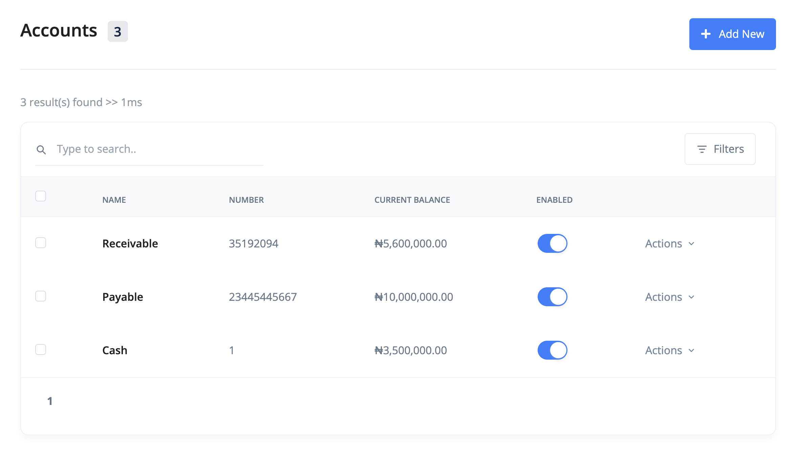

# How can I create an account?

An account(cash or bank account) is where money is kept.

- [Create Account](#create-account)
- [Edit Account](#edit-account)
- [FAQs](#faqs)

## Create Account 

The following are the steps for creating an account:

1. Click the `accounts` link from the sidebar navigation.

2. Click the `Add New` at the top right corner of the page.

3. Fill in the account's information and `save`.

## Edit Account 

To make changes to an account, use these steps:

1. Click the `accounts` link from the sidebar navigation.
2. Click edit from the dropdown actions of the bank account you want to edit.
3. Make your changes and `save`.

## FAQs 
