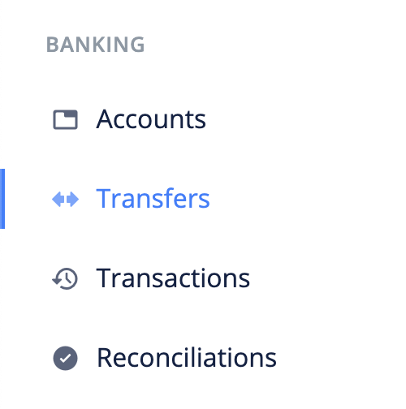
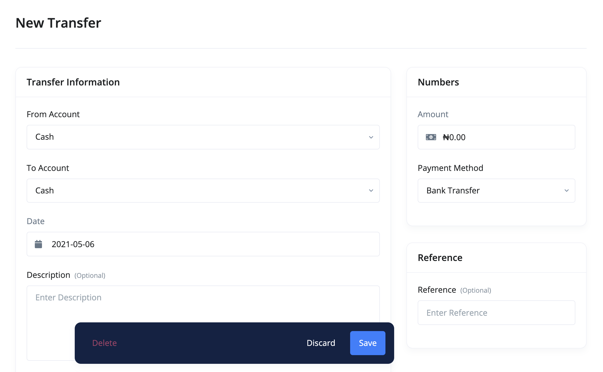

# How can I create a transfer?

Transfer is created when you want to move money from one account to another. For a single transfer, Ciniki creates a revenue and payment record for the accounts involved.

> Money transferred between transfers with different currencies will be converted to the currency of the receiving account based on the currency rates you have setup.

- [Create Transfer](#create-transfer)
- [Edit Transfer](#edit-transfer)
- [Import Transfers](#import-transfers)
- [Export Transfers](#export-transfers)
- [FAQs](#faqs)

## Create Transfer 

The following are the steps for creating a transfer:

1. Click the `transfers` link from the sidebar navigation.

2. Click the `Add New` at the top right corner of the page.

3. Fill in the transfer's information and `save`.

## Edit Transfer 

To make changes to a transfer, use these steps:

1. Click the `transfers` link from the sidebar navigation.
2. Click edit from the dropdown actions of the bank transfer you want to edit.
3. Make your changes and `save`.

## Import Transfers 

A very important feature of Ciniki is the ability to transfer data from other accounting softwares.

Use the following steps to import transfers into Ciniki:

1. Click the `Transfers` link from the sidebar navigation.
2. Click the `Import` button at the top left corner of the page. This brings up an import modal.

3. Download the sample file and adjust your file to its format.

4. Import your file.

## Export Transfers 

To export transfers:

1. Click the `Transfers` link from the sidebar navigation.
2. Click the `Export` button at the top left corner of the page. This brings up an export modal.

3. Adjust the export configurations and click the `Export` button.

## FAQs 
