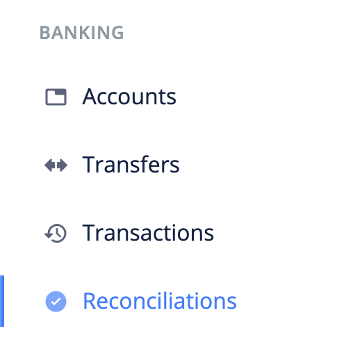
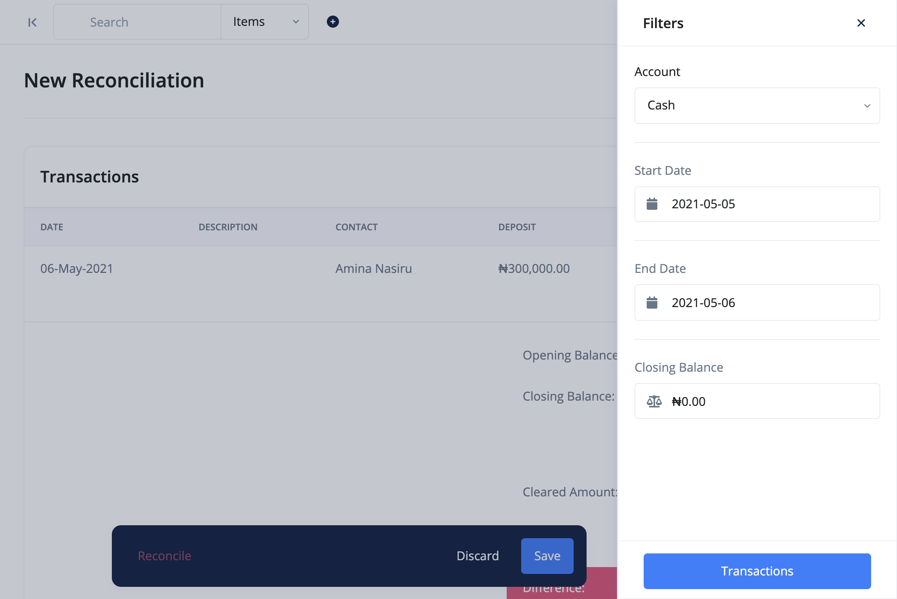

# What is Bank Reconciliation?

Bank reconciliation is a BizBooq feature that allows you to reconcile your bank statement with entries in BizBooq.

> Reconciled transactions can not be deleted. If you need to delete a reconciled transaction, you have to unreconcile it first.

- [Create Reconciliation](#create-reconciliation)
- [Edit Reconciliation](#edit-reconciliation)
- [FAQs](#faqs)

## Create Reconciliation 

The following are the steps for creating a reconciliation:

1. Click the `reconciliations` link from the sidebar navigation.

2. Click the `Add New` at the top right corner of the page.

3. Fill in the reconciliation's details and `save`.

## Edit Reconciliation 

To make changes to a reconciliation, use these steps:

1. Click the `reconciliations` link from the sidebar navigation.
2. Click edit from the dropdown actions of the reconciliation you want to edit.
3. Make your changes and `save`.

## FAQs 
