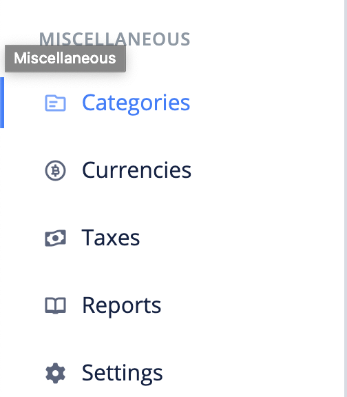
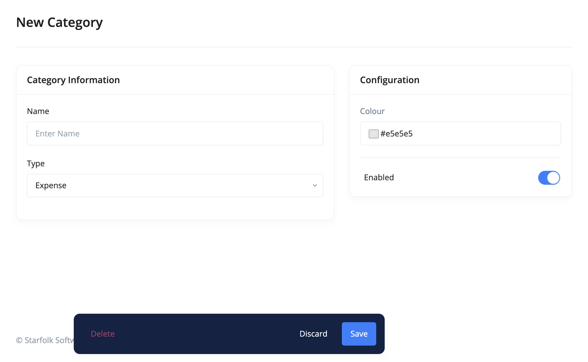

# What are categories?

Categories help you separate items, incomes, and expenses from each other.

- [Create Category](#create-category)
- [Edit Category](#edit-category)
- [FAQs](#faqs)

## Create Category 

The following are the steps for creating a category:

1. Click the `categories` link from the sidebar navigation.

2. Click the `Add New` at the top right corner of the page.

3. Fill in the category's information and `save`.

## Edit Category 

To make changes to a category, use these steps:

1. Click the `categories` link from the sidebar navigation.
2. Click edit from the dropdown actions of the category you want to edit.
3. Make your changes and `save`.

## FAQs 
