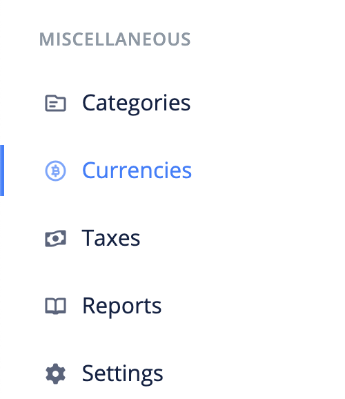
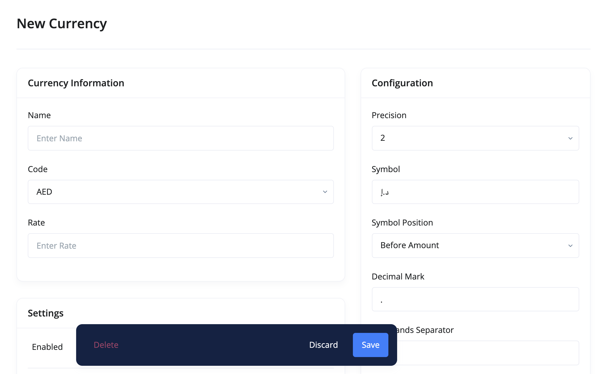

# How can I add a currency?

BizBooq supports multiple currency. This means you can record transactions conveniently in more than one currency without having to worry about conversitions.

- [Create Currency](#create-currency)
- [Edit Currency](#edit-currency)
- [FAQs](#faqs)

## Create Currency 

The following are the steps for creating a currency:

1. Click the `currencies` link from the sidebar navigation.

2. Click the `Add New` at the top right corner of the page.

3. Fill in the currency's information and `save`.

## Edit Currency 

To make changes to a currency, use these steps:

1. Click the `currencies` link from the sidebar navigation.
2. Click edit from the dropdown actions of the currency you want to edit.
3. Make your changes and `save`.

## FAQs 
