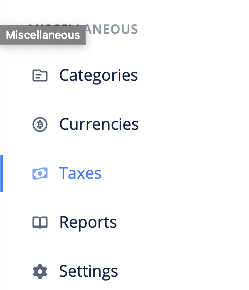
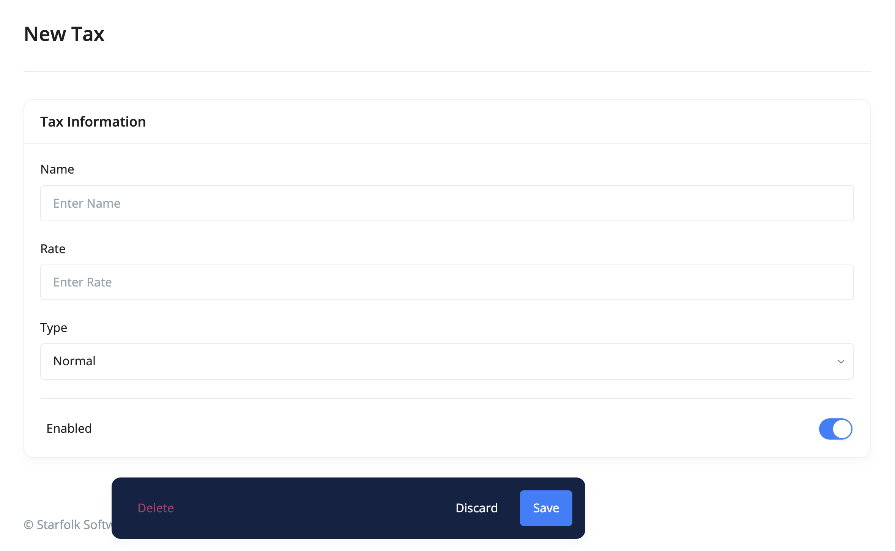

# How can I add a tax?

Taxes are used to impose fees on invoices, revenues, bills, and payments.

- [Create Tax](#create-tax)
- [Edit Tax](#edit-tax)
- [FAQs](#faqs)

## Create Tax 

The following are the steps for creating a tax:

1. Click the `taxes` link from the sidebar navigation.

2. Click the `Add New` at the top right corner of the page.

3. Fill in the tax's information and `save`.

## Edit Tax 

To make changes to a tax, use these steps:

1. Click the `taxes` link from the sidebar navigation.
2. Click edit from the dropdown actions of the tax you want to edit.
3. Make your changes and `save`.

## FAQs 
