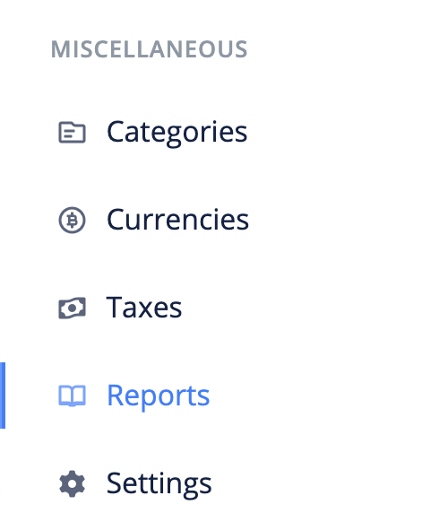
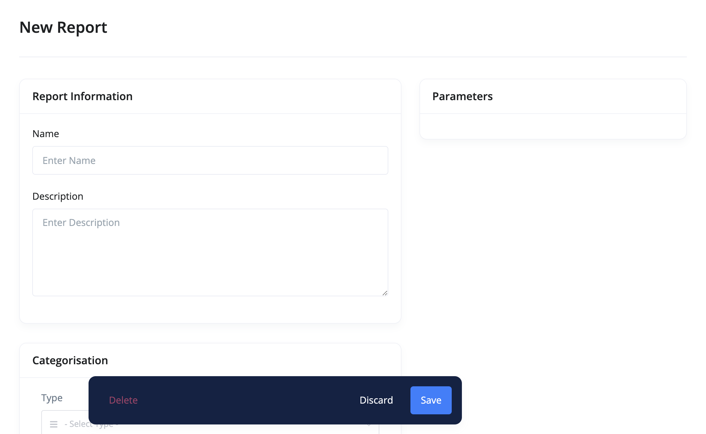

# Reports Overview

Reports allows you to get detailed financial data and help you better visualize all the information you need to improve your business. It gives you as a business owner a good idea of where your business income stands, month by month, and categorised.

All reports are displayed under the default currency. Income and expenses created under a different currency will be converted based on the currency rate at the time they were created.

- [Create Report](#create-report)
- [Edit Report](#edit-report)
- [FAQs](#faqs)

## Create Report 

The following are the steps for creating a report:

1. Click the `reports` link from the sidebar navigation.

2. Click the `Add New` at the top right corner of the page.

3. Fill in the report's information and `save`.

## Edit Report 

To make changes to a report, use these steps:

1. Click the `reports` link from the sidebar navigation.
2. Click edit from the dropdown actions of the report you want to edit.
3. Make your changes and `save`.

## FAQs 
