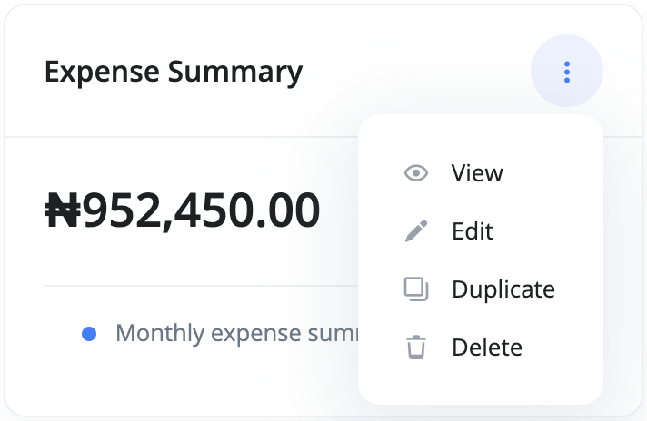
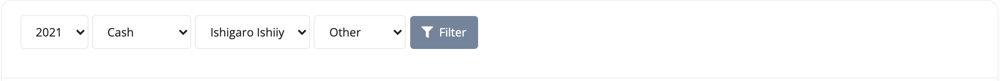

# What is an Expense Summary report?

The expense summary is a report that shows total expense in a specific period of time.

You can access your expense summary report by doing the following:

1. Go to the `Reports` section
2. Select Expense Summary from the list of reports' cards.

Use the filter section of the report page to adjust your view of the report:

- **Year** - This is the year you want the report to be adjusted to.
- **Account** - The account that you want the report to be for.
- **Category** - Here, you select the category for the report.
