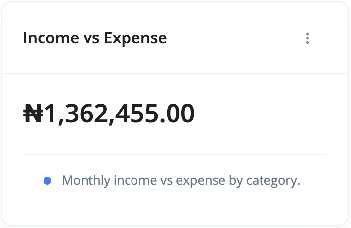
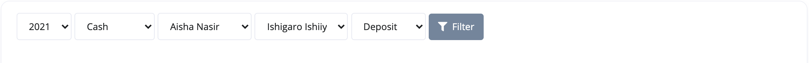

# What is an Income vs Expense Report?

Income vs Expense is a report that shows the difference between the sales and purchases of a customer and vendor respectively.

You can access your Income vs Expense report by doing the following:

1. Go to the `Reports` section
2. Select Income vs Expense from the list of reports' cards.

Use the filter section of the report page to adjust your view of the report:

- **Year** - This is the year you want the report to be adjusted to.
- **Account** - The account that you want the report to be for.
- **Customer** - The customer.
- **Vendor** - The vendor.
- **Category** - Here, you select the category for the report.
