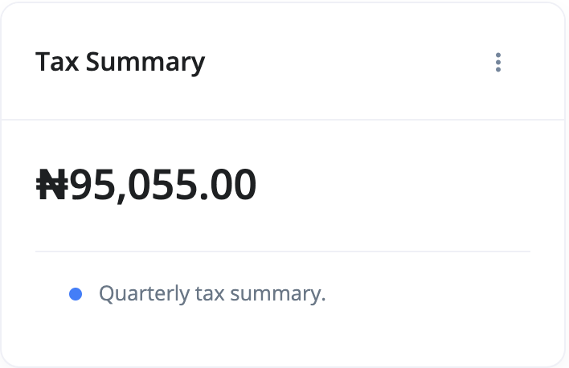

# What is a Tax Summary report?

The Tax Summary is a report that shows taxes of sales and purchases in a specific period of time.

You can access your Tax Summary report by doing the following:

1. Go to the `Reports` section
2. Select Tax Summary from the list of reports' cards.

Use the filter section of the report page to adjust your view of the report:

- **Year** - This is the year you want the report to be adjusted to.
