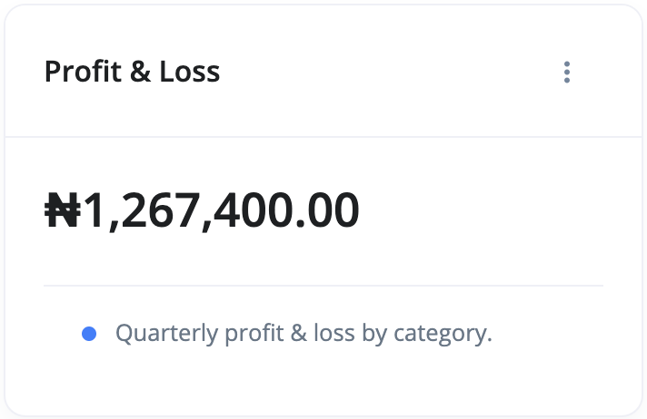
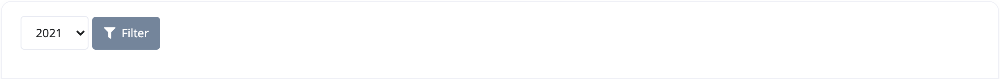

# What is a Profit and Loss report?

Profit and Loss shows your total income and your total expenses in a specific period of time.

You can access your income summary report by doing the following:

1. Go to the `Reports` section
2. Select Profit and Loss from the list of reports' cards.

Use the filter section of the report page to adjust your view of the report:

- **Year** - This is the year you want the report to be adjusted to.
