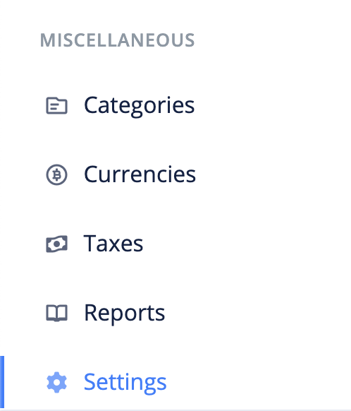
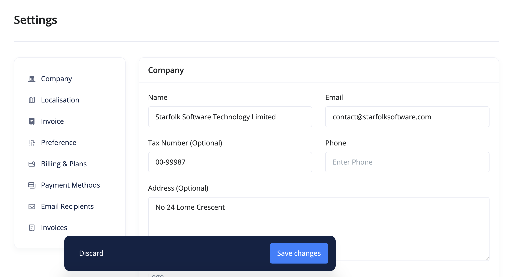

# How do i manage my company information?

To update your company information:

1. Click the `Settings` link from the sidebar navigation.

2. Look for the company section. It is at the top of the settings change. Make your changes and save.

- **Name** - This is the name of your business and is displayed on invoices, bills and in emails to your customers.

- **Email** - This is the official email of your company. It also serves as your paystack customer email.

- **Tax Number** - This is your company's tax identification number.

- **Phone** - This is your company's official phone number.

- **Address** - This is your business' address and appears on all invoices and bills.

- **Logo** - The official logo of your business. It appears on invoices and bills.