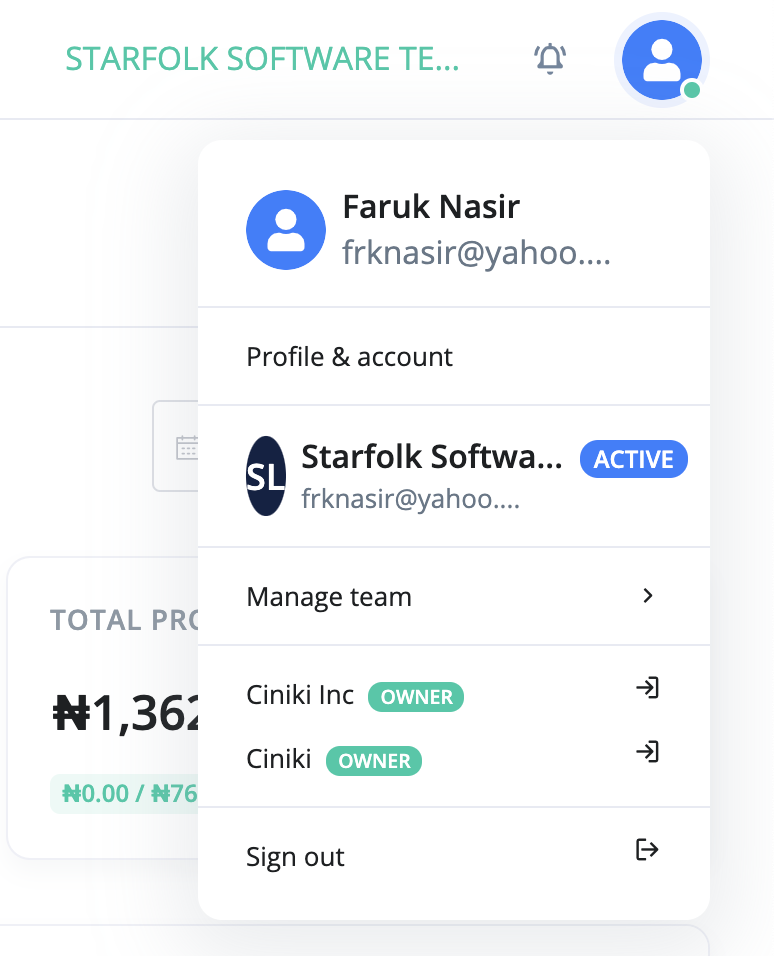
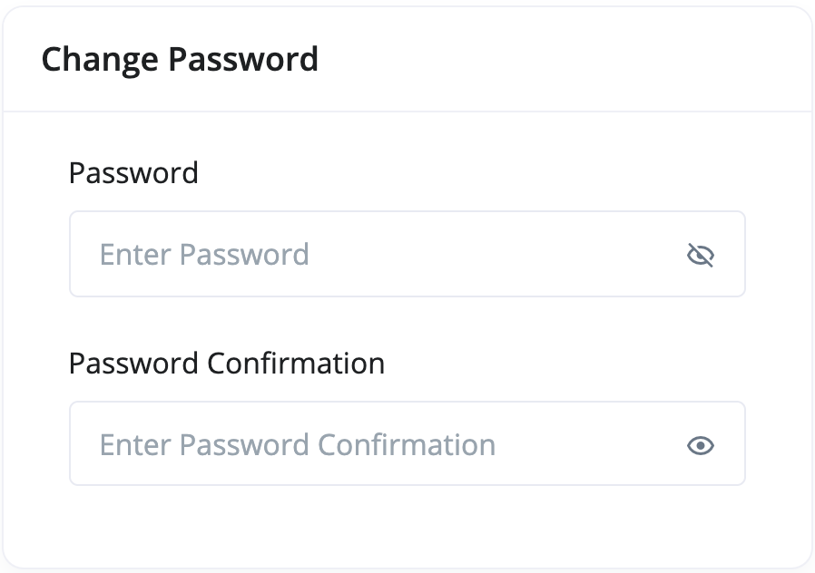

# How do i change my login credentials

To update your user profile:

1. Click on the **user icon** at the top right corner on the navigation bar.

2. Click on the **Profile & account** link

3. Update your password and save.

